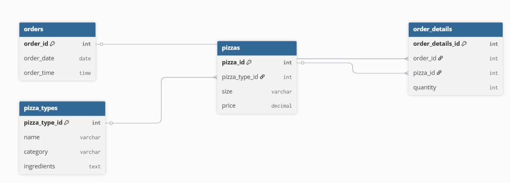

# 🍕 Pizza Shop Sales Analysis – SQL Project

## 📌 Overview
This project analyzes a pizza shop's sales data to uncover **sales trends, top-selling pizzas, and revenue patterns**.  
The analysis is performed using **SQL (MySQL)** and presented in a structured format with clear insights and visualizations.

---

## 🎯 Project Goal
- **Objective:**  
  Analyze pizza shop sales data to:
  - Identify best-selling products
  - Determine revenue trends
  - Find customer purchase patterns
- **Dataset Details:**  
  - **Tables:** `orders`, `order_details`, `pizzas`, `pizza_types`
  - **Time Period:** January 2015
  - **Tools Used:** MySQL

---

## 📊 Analysis Roadmap

### 1️⃣ Sales & Revenue Overview
- 📦 Total number of orders placed  
- 💰 Total revenue generated  
- 🏆 Highest-priced pizza  
- 📏 Most common pizza size ordered  

### 2️⃣ Product Popularity Insights
- 🔝 Top 5 most ordered pizza types by quantity  
- 💵 Top 3 pizza types by revenue  
- 🏷 Top 3 pizza types by revenue within each category  

### 3️⃣ Category & Size Trends
- 🍽 Total quantity sold per pizza category  
- 📊 Category-wise distribution of pizzas  

### 4️⃣ Time-Based Trends
- ⏱ Order distribution by hour of the day  
- 📅 Average number of pizzas ordered per day  
- 📈 Cumulative revenue over time  

### 5️⃣ Revenue Contribution
- 💹 Percentage contribution of each pizza type to total revenue  

---

## 🗄 Database Schema
**Tables:**
1. **orders**  
   - `order_id` (PK)  
   - `order_date`  
   - `order_time`  

2. **order_details**  
   - `order_details_id` (PK)  
   - `order_id` (FK → orders)  
   - `pizza_id` (FK → pizzas)  
   - `quantity`  

3. **pizzas**  
   - `pizza_id` (PK)  
   - `pizza_type_id` (FK → pizza_types)  
   - `size`  
   - `price`  

4. **pizza_types**  
   - `pizza_type_id` (PK)  
   - `name`  
   - `category`  
   - `ingredients`  

📌 **ER Diagram:**  

---

## 📈 Key Insights
- 🍕 **Top 3 pizzas by revenue:** Thai Chicken Pizza, Barbecue Chicken Pizza, California Pizza  
- 📈 **Peak sales time:** Friday evenings  
- 🏆 **Most popular category:** Classic  
- 💰 **Total Sales:** 817,860.05  

---

## 📂 Project Structure
Pizza_Shop_Sales/
│── README.md
│── pizza_shop_schema.png
│── Pizza_shop_sales.pdf
└── data/
├── orders.csv
├── order_details.csv
├── pizzas.csv
└── pizza_types.csv